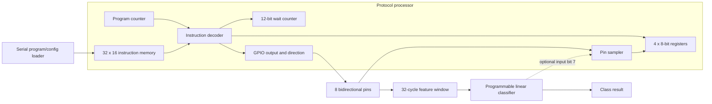

# Dhruva Uppaluri — Programmable Protocol Emulator ASIC

[](https://github.com/dhruvauppaluri/Dhruva-Uppaluri-JaneStreetASIC/actions/workflows/rtl-simulation.yml)
[](https://github.com/dhruvauppaluri/Dhruva-Uppaluri-JaneStreetASIC/actions/workflows/gds.yaml)

An open-source, cycle-deterministic protocol emulator developed in response to
Jane Street's [protocol emulator ASIC competition](https://blog.janestreet.com/protocol-emulator-asic-competition/).
The chip executes firmware that reads and drives pins with exact timing, so
UART, SPI, I2C, and future protocols use the same processor instead of fixed
per-protocol peripherals.

The design also includes a deliberately small ML-inspired extension: a
programmable linear classifier measures edge and duty-cycle signatures on two
pins. Firmware can use its result to select a protocol handler or flag unusual
activity. This is a tiny inference primitive, not a general AI accelerator.

> This is an independent project and is not affiliated with or endorsed by
> Jane Street.

## Current status

The complete synthesizable ASIC top level is implemented and locally verified:

- 32-word, 16-bit serially loadable instruction memory
- four 8-bit registers
- eight bidirectional protocol pins
- 16-instruction ISA with deterministic waits, pin sampling, integer/bit
  operations, branches, and pin-level waiting
- Tiny Tapeout IHP CMOS5L wrapper and 6x4 competition configuration
- assembler plus UART, SPI, and I2C example firmware
- programmable four-feature protocol signature classifier
- self-checking RTL tests, lint, generic synthesis, and physical-design CI

Local Yosys synthesis reports approximately 3,088 generic cells for the full
processor, loader, and classifier before IHP standard-cell mapping. This is an
early complexity measurement, not a substitute for the LibreLane post-route
area and timing reports produced by the GDS workflow.

## Architecture



The classifier features are transition count and high-cycle count on protocol
pins 0 and 1. Four signed INT8 weights and a signed 16-bit bias are serially
programmable. One multiplier is reused across all features to keep the
hardware small.

## Instruction set

Instructions contain a 4-bit opcode and 12-bit operand.

| Opcode | Instruction | Purpose |
| --- | --- | --- |
| `0` | `NOP` | No operation |
| `1` | `OUT value` / `OUT Rn` | Drive an immediate or register value |
| `2` | `DIR mask` | Select input/output direction per pin |
| `3` | `WAIT cycles` | Insert deterministic idle clocks |
| `4` | `IN Rn` | Sample all input pins |
| `5` | `LDI Rn, value` | Load immediate |
| `6` | `ANDI Rn, value` | Mask sampled values |
| `7` | `XORI Rn, value` | XOR or toggle bits |
| `8` | `ADDI Rn, value` | Add modulo 256 |
| `9/A` | `SHL` / `SHR` | Shift register data |
| `B` | `JMP address` | Unconditional branch |
| `C/D` | `JZ` / `JNZ` | Conditional branch |
| `E` | `WAIT_PIN pin, level` | Wait for a pin level |
| `F` | `HALT` | Stop until reset |

See [docs/instruction-set.md](docs/instruction-set.md) for encodings and
programming details.

## Included firmware

| Program | Demonstration |
| --- | --- |
| `firmware/uart_tx_a5.asm` | Sends `0xA5` as 1 Mbit/s 8N1 UART at 50 MHz |
| `firmware/spi_mode0_nibble.asm` | Sends `0xA` MSB-first in SPI mode 0 |
| `firmware/i2c_start_stop.asm` | Generates open-drain I2C START and STOP |

Assemble a program with:

```sh
python3 tools/assemble.py firmware/uart_tx_a5.asm uart_tx_a5.hex
```

The resulting file contains 32 hexadecimal instruction words. Shift each word
MSB-first into the ASIC wrapper and pulse commit after every sixteen bits.

## Tiny Tapeout pins

| Pin | Function |
| --- | --- |
| `ui_in[0]` | Serial loader data, MSB first |
| `ui_in[1]` | Shift strobe |
| `ui_in[2]` | Commit one 16-bit word |
| `ui_in[3]` | `0` load/pause, `1` run |
| `ui_in[4]` | Loader target: program memory or classifier configuration |
| `ui_in[5]` | Restart loader address at zero |
| `ui_in[6]` | Route classifier result to processor input bit 7 |
| `uio[7:0]` | Bidirectional protocol pins |
| `uo_out[4:0]` | Program counter |
| `uo_out[5]` | Halted status |
| `uo_out[6]` | Timed-wait status |
| `uo_out[7]` | Classifier result |

## Verification

Run the complete local regression:

```sh
make all
```

This runs every earlier milestone test, complete ISA verification, UART
firmware timing, classifier verification, serial-loader/wrapper verification,
Verilator lint, and Yosys synthesis.

The primary expected pass messages are:

```text
PASS: complete protocol processor ISA and timing verified
PASS: UART 0xA5 firmware timing verified at 1 Mbit/s
PASS: programmable protocol signature classifier verified
PASS: Tiny Tapeout serial loading and execution verified
```

GitHub Actions runs the RTL regression on every push. The separate GDS workflow
invokes the official Tiny Tapeout IHP CMOS5L build, precheck, and gate-level
simulation actions.

## Earlier Cyclone V results

The precursor timing blocks were fitted independently for Cyclone V
`5CSEMA5F31C6` at 100 MHz in Quartus Prime Lite 25.1:

| Block | ALMs | Registers | Setup slack | Fmax |
| --- | ---: | ---: | ---: | ---: |
| Programmable pin generator | 11 | 7 | +4.621 ns | 185.91 MHz |
| Fixed UART transmitter | 32 | 40 | +3.265 ns | 148.48 MHz |

These modules remain as verified development milestones; the loadable
processor in `src/` is the ASIC target.

## Remaining tapeout sign-off

RTL completion is not the same as a fabricated chip. Before submission, the
generated physical design must pass the official IHP CMOS5L flow, including
placement, routing, timing, design-rule checks, layout-versus-schematic checks,
and gate-level simulation. This repository contains the configuration and CI
workflow for those sign-off steps so the physical results remain reproducible.

## License

This project is available under the [MIT License](LICENSE).
