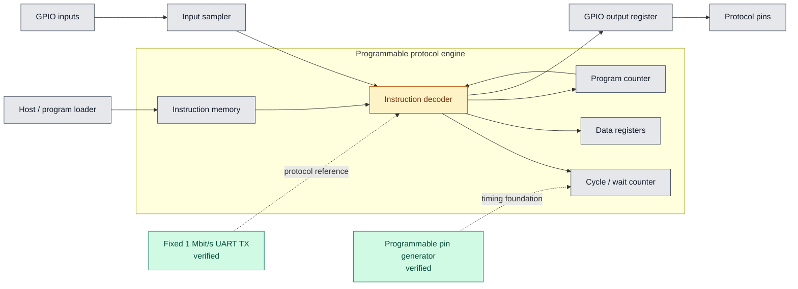

# Dhruva Uppaluri - JaneStreetASIC

[](https://github.com/dhruvauppaluri/Dhruva-Uppaluri-JaneStreetASIC/actions/workflows/rtl-simulation.yml)

An open-source, cycle-accurate protocol emulator in Verilog, developed in
response to Jane Street's [protocol emulator ASIC competition](https://blog.janestreet.com/protocol-emulator-asic-competition/).

The long-term goal is a small programmable processor that can read pins, write
pins, and wait an exact number of clock cycles. Protocols such as UART, SPI,
and I2C will be expressed as programs for the same execution engine.

> This is an independent project and is not affiliated with or endorsed by
> Jane Street.

## Current status

The project currently has two verified building blocks:

| Block | What it demonstrates | Verification status |
| --- | --- | --- |
| Programmable pin generator | Exact cycle counting, runtime timing, pause/resume, and safe handling of a zero-cycle configuration | Questa self-check passes |
| UART transmitter | 1 Mbit/s 8N1 transmission, LSB-first serialization, input latching, and `busy`/`done` control | Questa self-check passes for `0x55` and `0xA3` |

Both testbenches pass with zero simulator errors and warnings using a 100 MHz
input clock. The pin-generator test covers 5-cycle and 3-cycle timing, a
4-clock pause followed by continuation from the saved count, and zero-cycle
safe-idle behavior. The UART test verifies two complete 10-bit frames in
20.096 microseconds of simulation time.

## Cyclone V implementation results

Both RTL blocks compile, fit, and pass setup and hold timing at 100 MHz for the
Cyclone V `5CSEMA5F31C6` in Quartus Prime Lite 25.1. The values below come from
the final timing model at the slow 1100 mV, 85 C corner.

| Block | ALMs | Registers | RAM bits | DSPs | Setup slack at 100 MHz | Hold slack | Fmax |
| --- | ---: | ---: | ---: | ---: | ---: | ---: | ---: |
| Programmable pin generator | 11 / 32,070 (<1%) | 7 | 0 | 0 | +4.621 ns | +0.368 ns | 185.91 MHz |
| UART transmitter | 32 / 32,070 (<1%) | 40 | 0 | 0 | +3.265 ns | +0.340 ns | 148.48 MHz |

The clock is fitted to a device pin and constrained to a 10 ns period. Data and
control ports are virtual pins because this repository does not yet target a
specific development-board pinout. The internal logic utilization and
register-to-register timing are valid for this device; board-level I/O timing
must be measured again after assigning the real board pins and I/O standards.

## Architecture



Green blocks are verified today. The instruction decoder is the next major
design step; gray blocks show the complete target architecture.

## Repository contents

| File | Purpose |
| --- | --- |
| `pin_generator.sv` | Programmable cycle-based output generator |
| `pin_generator_tb.sv` | Self-checking timing, enable, and safety tests |
| `uart_tx.sv` | Parameterized 8N1 UART transmitter |
| `uart_tx_tb.sv` | Self-checking two-frame UART test |
| `quartus/pin_generator/` | Reproducible Cyclone V project and 100 MHz timing constraint |
| `quartus/uart_tx/` | Reproducible Cyclone V project and 100 MHz timing constraint |

## Run the simulations

The commands below use Questa/ModelSim and create a local `work` library.

```tcl
vlib work
vlog pin_generator.sv pin_generator_tb.sv
vsim -c work.pin_generator_tb -do "run -all; quit -f"

vlog uart_tx.sv uart_tx_tb.sv
vsim -c work.uart_tx_tb -do "run -all; quit -f"
```

Expected results:

```text
PASS: timing, enable pause, and zero-cycle safety verified
PASS: UART transmitted 0x55 and 0xA3 correctly
```

GitHub Actions also runs both self-checking simulations on every push with
Icarus Verilog.

## Run the Cyclone V builds

With Quartus Prime Lite 25.1 on `PATH`, run:

```powershell
quartus_sh --flow compile quartus/pin_generator/pin_generator
quartus_sh --flow compile quartus/uart_tx/uart_tx
```

The generated `db`, `incremental_db`, and `output_files` directories are
ignored by Git. The reports in each `output_files` directory contain the fitted
resource and timing results.

## Design details

### Programmable pin generator

- Accepts a 4-bit `cycles_per_toggle` value.
- Toggles after the requested number of enabled 100 MHz clock edges.
- Holds its counter and output while `enable` is low.
- Drives a safe idle-low output when `cycles_per_toggle` is zero.

### UART transmitter

- Uses a five-state FSM: `IDLE`, `START_BIT`, `DATA_BITS`, `STOP_BIT`, and
  `DONE`.
- Defaults to 100 clocks per bit, producing 1 Mbit/s from a 100 MHz clock.
- Transmits one start bit, eight data bits LSB first, and one stop bit.
- Latches the input byte when `start` is accepted.
- Holds `busy` throughout the frame and pulses `done` for one clock afterward.

## Roadmap

- [x] Verify exact cycle counting at 100 MHz
- [x] Add programmable timing and pause/resume control
- [x] Define safe behavior for invalid zero-cycle timing
- [x] Build and verify a fixed 1 Mbit/s UART transmitter
- [ ] Define the first instruction encoding (`SET`, `WAIT`, `HALT`)
- [ ] Implement instruction memory, program counter, and decoder
- [ ] Express UART transmission as a program
- [ ] Add pin sampling and conditional branches
- [ ] Demonstrate SPI and I2C programs on the same engine
- [x] Synthesize for Cyclone V and track logic, register, memory, and Fmax data
- [ ] Port to the Tiny Tapeout IHP 130 nm CMOS5L flow

## Today's milestone — September 14, 2026

- Verified configurable 5-cycle and 3-cycle output timing at 100 MHz.
- Verified a 4-clock pause with exact continuation from the saved count.
- Added deterministic zero-cycle safe-idle behavior.
- Implemented and verified two 1 Mbit/s UART frames with automated checks.
- Fit both blocks for a Cyclone V `5CSEMA5F31C6` and closed timing at 100 MHz
  across every analyzed setup and hold corner.

## License

This project is available under the [MIT License](LICENSE).
