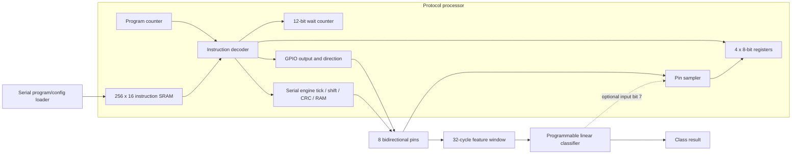

# Dhruva Uppaluri — Programmable Protocol Emulator ASIC

[](https://github.com/dhruvauppaluri/Dhruva-Uppaluri-JaneStreetASIC/actions/workflows/rtl-simulation.yml)
[](https://github.com/dhruvauppaluri/Dhruva-Uppaluri-JaneStreetASIC/actions/workflows/gds.yaml)

An open-source, cycle-deterministic protocol emulator developed in response to
Jane Street's [protocol emulator ASIC competition](https://blog.janestreet.com/protocol-emulator-asic-competition/).
The chip executes firmware that reads and drives pins with exact timing, so
UART, SPI, I2C, and future protocols use the same processor instead of fixed
per-protocol peripherals.

The design also includes a deliberately small ML-inspired extension: a
programmable linear classifier measures edge and duty-cycle signatures on two
pins. Firmware can use its result to select a protocol handler or flag unusual
activity. This is a tiny inference primitive, not a general AI accelerator.

> This is an independent project and is not affiliated with or endorsed by
> Jane Street.

## Current status

**RTL milestone: implementation complete and simulation verified. Physical
tapeout sign-off remains pending.**

The current synthesizable top level includes:

- 256-word, 16-bit serially loadable instruction SRAM (inferrable combo-read
  array; Yosys still maps it to flip-flops. A Tiny Tapeout IHP
  `RM_IHPSG13_1P_256x16` macro can replace the wrapper for GDS)
- four 8-bit registers
- eight bidirectional protocol pins
- 16-instruction ISA with deterministic waits, pin sampling, integer/bit
  operations, branches, and pin-level waiting
- shared serial engine (tick, 1- or 2-bit shifter, NRZI+stuff or NRZ,
  CRC-16/CRC-32, 64-byte packet RAM, TX and RX, Map A pin overlay) reached
  through reserved `OUT`/`IN` encodings
- Tiny Tapeout IHP CMOS5L wrapper and 6x4 competition configuration
- assembler plus UART, SPI, I2C, USB LS device-lite, and RMII MAC firmware
- self-checking waveform and cycle-timing tests for the example protocols
- programmable four-feature protocol signature classifier
- self-checking RTL tests, lint, and generic synthesis
- a configured IHP CMOS5L physical-design workflow for later tapeout sign-off

Local Yosys generic synthesis reports approximately **15,103** cells
(`$_DFFE_PP_` **4,616**, of which **4,096** are the 256×16 inferrable IMEM).
The serial engine, 64-byte packet RAM (~512 flops), RX, CRC-32, and RMII
hold account for the rest of the growth versus the earlier TX-only stretch
(~11.6k). This is an early complexity measurement, not a substitute for the
LibreLane post-route area and timing reports produced by the GDS workflow.
A compiled Tiny Tapeout SRAM macro in `src/instruction_sram.sv` is the
intended IMEM reduction if 6×4 routing is tight. See
[docs/physical-design-lab.md](docs/physical-design-lab.md).

## Stretch goals (on-die SIE / MAC)

Process: IHP **130 nm CMOS5L** through Tiny Tapeout. Tile size: **6×4**.

Jane Street names UART/SPI/I2C as the baseline and **low-speed USB** plus
**10 Mbit Ethernet** as stretch goals. This design keeps a general-purpose
firmware CPU (RP2040 PIO / PRU style) instead of taping out fixed UART, SPI,
I2C, USB, or Ethernet IP. One serial engine is programmed by USB firmware
**and** Ethernet firmware.

| Stretch | What is implemented | What is not claimed |
| --- | --- | --- |
| USB low-speed | Programmable SIE on `uio[0:1]` (D+/D−): 33-cycle tick at 50 MHz, NRZI, stuffing, CRC-16, RX+TX. Device-lite firmware: bus reset, `SET_ADDRESS`, `GET_DESCRIPTOR` (device) | Full device/host stack, strings/config/HID, analog USB PHY, 5 V signaling |
| 10 Mbit Ethernet | On-die 10 Mbps MAC via RMII-10 on `uio[2:7]` to an external LAN8720-class PHY: preamble/SFD, CRC-32, IFG, 64-byte RAM | On-die 10BASE-T PMA, magnetics, 100 Mbps, MDIO hardware, ENC28J60 as the Ethernet path |

Analog PHY, magnetics, and RJ45 stay on the board. Board hookup (1.5 kΩ LS
pull-up on D−, LAN8720 RMII, load/run) is in
[docs/dut-integration.md](docs/dut-integration.md).

## Architecture


```mermaid
flowchart LR
    Host[Serial program/config loader] --> IMEM[256 x 16 instruction SRAM]

    subgraph CPU[Protocol processor]
        PC[Program counter] --> Decode[Instruction decoder]
        IMEM --> Decode
        Decode --> Timer[12-bit wait counter]
        Decode --> Regs[4 x 8-bit registers]
        Decode --> GPIO[GPIO output and direction]
        Decode --> Assist[Serial engine tick / shift / CRC / RAM]
        Inputs[Pin sampler] --> Regs
    end

    Pins[8 bidirectional pins] --> Inputs
    GPIO --> Pins
    Assist --> Pins

    Pins --> Features[32-cycle feature window]
    Features --> Classifier[Programmable linear classifier]
    Classifier --> Status[Class result]
    Classifier -. optional input bit 7 .-> Inputs
```

The classifier features are transition count and high-cycle count on protocol
pins 0 and 1. Four signed INT8 weights and a signed 16-bit bias are serially
programmable. One multiplier is reused across all features to keep the
hardware small.

## Instruction set

Instructions contain a 4-bit opcode and 12-bit operand.

| Opcode | Instruction | Purpose |
| --- | --- | --- |
| `0` | `NOP` | No operation |
| `1` | `OUT value` / `OUT Rn` | Drive an immediate or register value |
| `2` | `DIR mask` | Select input/output direction per pin |
| `3` | `WAIT cycles` | Insert deterministic idle clocks |
| `4` | `IN Rn` | Sample all input pins |
| `5` | `LDI Rn, value` | Load immediate |
| `6` | `ANDI Rn, value` | Mask sampled values |
| `7` | `XORI Rn, value` | XOR or toggle bits |
| `8` | `ADDI Rn, value` | Add modulo 256 |
| `9/A` | `SHL` / `SHR` | Shift register data |
| `B` | `JMP address` | Unconditional branch |
| `C/D` | `JZ` / `JNZ` | Conditional branch |
| `E` | `WAIT_PIN pin, level` | Wait for a pin level |
| `F` | `HALT` | Stop until reset |
| `OUT`/`IN` reserved | `AOUT` / `AIN` | Serial engine MMIO (tick, shift, CRC, RAM) |

See [docs/instruction-set.md](docs/instruction-set.md) for encodings and
programming details.

## Included firmware

| Program | Demonstration |
| --- | --- |
| `firmware/uart_tx_a5.asm` | Sends `0xA5` as 1 Mbit/s 8N1 UART at 50 MHz |
| `firmware/spi_mode0_nibble.asm` | Sends `0xA` MSB-first in SPI mode 0 |
| `firmware/i2c_start_stop.asm` | Generates open-drain I2C START and STOP |
| `firmware/usb_ls_sync_pid.asm` | USB LS SYNC + DATA0 PID (SIE smoke test) |
| `firmware/usb_ls_data0_crc.asm` | USB LS DATA0 byte with hardware CRC-16 |
| `firmware/usb_ls_device_lite.asm` | USB LS device-lite: reset, SET_ADDRESS, GET_DESCRIPTOR |
| `firmware/eth_rmii_min_frame.asm` | 10 Mbps RMII MAC TX, preamble, CRC-32, IFG |
| `firmware/eth_rmii_loopback.asm` | Same MAC, then RX for PHY-model loopback |
| `firmware/enc28j60_min_frame.asm` | Generic SPI example (not the Ethernet stretch) |

Assemble a program with:

```sh
python3 tools/assemble.py firmware/uart_tx_a5.asm uart_tx_a5.hex
```

The resulting file contains 256 hexadecimal instruction words. Shift each word
MSB-first into the ASIC wrapper and pulse commit after every sixteen bits.

The normal operating sequence is:

1. Assert reset to initialize the processor and loader address.
2. Deassert reset while keeping `ui_in[3]` low.
3. Serially load the program and optional classifier configuration.
4. Set `ui_in[3]` high to execute from instruction address zero.

Do not reset after loading classifier weights because reset intentionally
returns the classifier configuration to its safe zero state.

## Tiny Tapeout pins

| Pin | Function |
| --- | --- |
| `ui_in[0]` | Serial loader data, MSB first |
| `ui_in[1]` | Shift strobe |
| `ui_in[2]` | Commit one 16-bit word |
| `ui_in[3]` | `0` load/pause, `1` run |
| `ui_in[4]` | Loader target: program memory or classifier configuration |
| `ui_in[5]` | Restart loader address at zero |
| `ui_in[6]` | Route classifier result to processor input bit 7 |
| `ui_in[7]` | Load: engine MMIO target. Run: show `PC[7:5]` on `uo_out[2:0]` |
| `uio[0]` | USB D+ / protocol pin 0 |
| `uio[1]` | USB D− / protocol pin 1 |
| `uio[2]` | RMII TXD0 / protocol pin 2 |
| `uio[3]` | RMII TXD1 / protocol pin 3 |
| `uio[4]` | RMII TX_EN / protocol pin 4 |
| `uio[5]` | RMII RXD0 / protocol pin 5 |
| `uio[6]` | RMII RXD1 / protocol pin 6 |
| `uio[7]` | RMII CRS_DV / protocol pin 7 |
| `uo_out[4:0]` | Program counter `[4:0]` (high bits truncated unless `ui_in[7]`) |
| `uo_out[5]` | Halted status |
| `uo_out[6]` | Timed-wait status |
| `uo_out[7]` | Classifier result |

## Verification

Run the complete local regression:

```sh
make all
```

This runs every earlier milestone test, complete ISA verification, UART/SPI/I2C
firmware timing, USB LS device-lite and RMII MAC tests, the generic SPI
example, classifier verification, serial-loader/wrapper verification, Verilator
lint, and Yosys synthesis. `make test-stretch` runs only the serial engine,
USB enumerate, and RMII loopback tests.

The primary expected pass messages are:

```text
PASS: complete protocol processor ISA and timing verified
PASS: UART 0xA5 firmware timing verified at 1 Mbit/s
PASS: SPI mode-0 firmware transmitted 0xA with exact timing
PASS: open-drain I2C START/STOP firmware timing verified
PASS: programmable protocol signature classifier verified
PASS: Tiny Tapeout serial loading and execution verified
PASS: assist NRZI, bit stuffing, and USB CRC-16 verified
PASS: serial engine CRC-32 and RMII-10 hold verified
PASS: USB LS SYNC/PID and DATA0 CRC firmware verified
PASS: USB LS SET_ADDRESS and GET_DESCRIPTOR device-lite verified
PASS: RMII-10 MAC loopback preamble, payload, CRC-32 verified
PASS: ENC28J60 SPI min-frame firmware verified
```

GitHub Actions runs the RTL regression on every push. The separate GDS workflow
is configured to invoke the official Tiny Tapeout IHP CMOS5L build, precheck,
and gate-level simulation actions; passing that workflow is part of the later
physical tapeout milestone, not a completed claim in this README.

On Windows with Quartus Prime Lite 25.1 and Questa installed in its default
location, run the same self-checking RTL and firmware simulations with:

```powershell
powershell -ExecutionPolicy Bypass -File scripts/run_questa.ps1
```

Pass `-QuestaBin <path>` if the Questa executables are installed elsewhere.
The script explicitly optimizes each testbench before simulation, avoiding
spurious optimized-library cleanup warnings in OneDrive-backed folders.

## Earlier Cyclone V results

The precursor timing blocks were fitted independently for Cyclone V
`5CSEMA5F31C6` at 100 MHz in Quartus Prime Lite 25.1:

| Block | ALMs | Registers | Setup slack | Fmax |
| --- | ---: | ---: | ---: | ---: |
| Programmable pin generator | 11 | 7 | +4.621 ns | 185.91 MHz |
| Fixed UART transmitter | 32 | 40 | +3.265 ns | 148.48 MHz |

These modules remain as verified development milestones; the loadable
processor in `src/` is the ASIC target.

## Remaining tapeout sign-off

RTL completion is not the same as a fabricated chip. Before submission, the
generated physical design must pass the official IHP CMOS5L flow, including
placement, routing, timing, design-rule checks, layout-versus-schematic checks,
and gate-level simulation. This repository contains the configuration and CI
workflow for those sign-off steps so the physical results remain reproducible.

To learn that work hands-on rather than treating the flow as a black box, use
the staged [physical-design and tapeout lab](docs/physical-design-lab.md). It
defines what to run, inspect, measure, and understand at each stage without
claiming that physical sign-off has already been completed.

## License

This project is available under the [MIT License](LICENSE).
